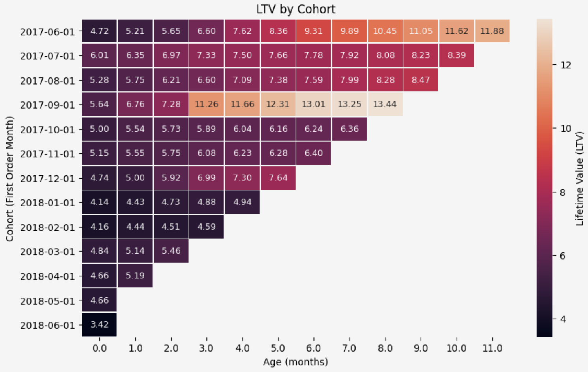

# 
ANALÍTICA DE DATOS EN SHOWZ, UNA EMPRESA DE VENTAS DE ENTRADAS DE EVENTOS

## Descripción del Proyecto

Trabajo en el departamento de analítica de Showz, una empresa de venta de entradas de eventos. La tarea es ayudar a optimizar los gastos de marketing **(estudio de caso simulado).**

Se cuenta con:

- Registros del servidor con datos sobre las visitas a Showz desde enero de 2017 hasta diciembre de 2018.
- Un archivo con los pedidos en este periodo.
- Estadísticas de gastos de marketing.

Lo que se va a investigar:

- Cómo los clientes usan el servicio.
- Cuándo empiezan a comprar.
- Cuánto dinero aporta cada cliente a la compañía.
- Cuándo los ingresos cubren el costo de adquisición de los clientes.

 
 

## LIBRERÍAS UTILIZADAS

- Pandas
- Numpy
- matplotlib
- seaborn
- math
- scipy

---
 

# 
VISUALIZACIONES

Podemos encontrar, por ejemplo, un *heatmap* para el periodo de septiembre 2017 que es donde se puede evidenciar un ciclo de vida de cliente mayor (el doble al promedio general) lo que se traduce en que cada cliente aporta mayor ingreso neto. En los cohortes de Junio 2017 a partir del 6 mes es cuando se presentan LTV altos, clientes más recurrentes y fieles al negocio o por su parte han tenido una buena experiencia de usuario, atención al cliente en la venta de entradas.
